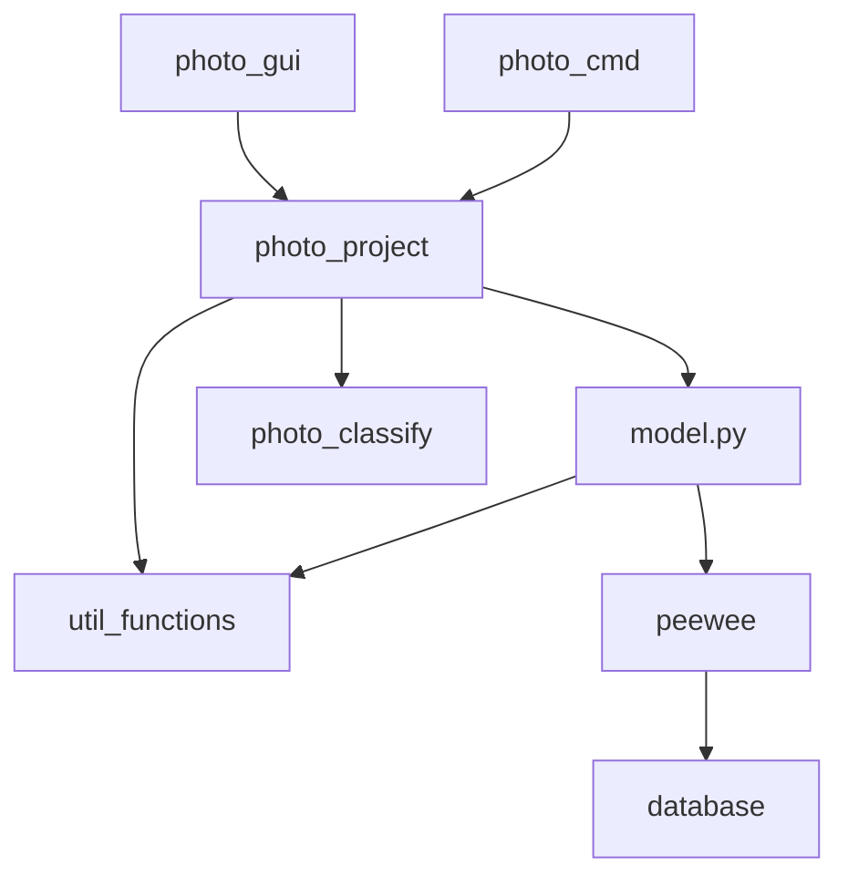
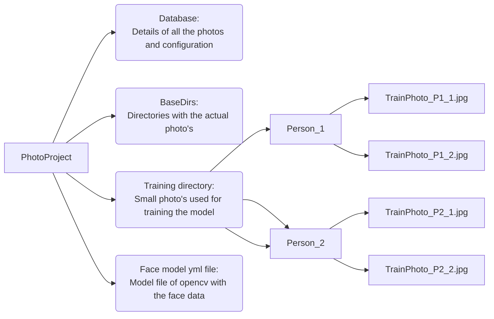
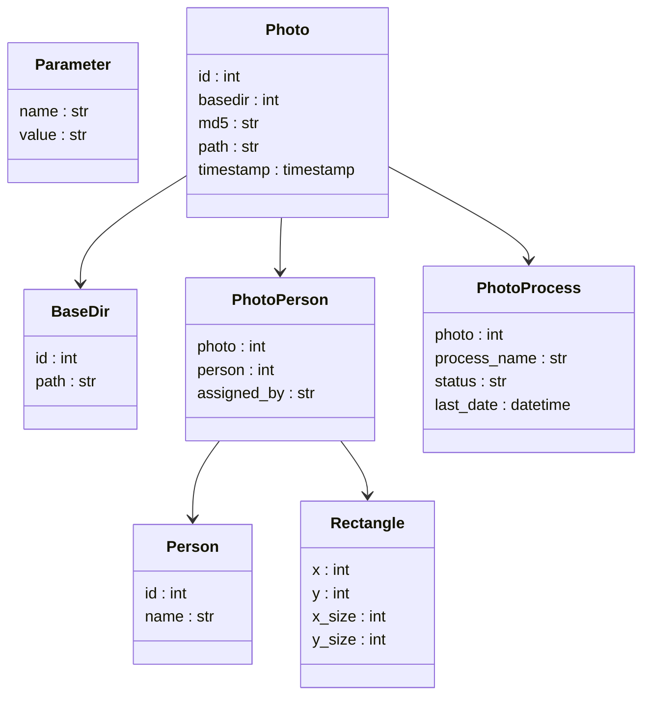
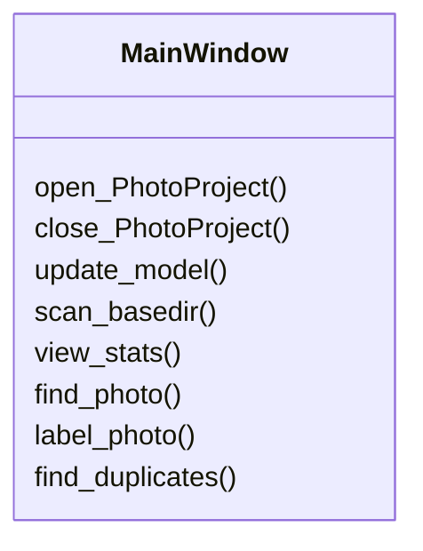

# Design of fotos

## Overview

## photo_project

Goal is to have one entry point for all the functionality, independent of the user interface

### Overview of a photo project

### Database

The database model is based on [peewee-orm](https://docs.peewee-orm.com/)

## Photo GUI

## Todo and ideas

- [ ] New Project function
- [ ] Progress bar
- [ ] Face dect in GUI
- [ ] Scan in GUI
- [ ] Log level in separate menu
- [ ] View menu, introduce different views (file list, minuatures)
- [ ] Dockable panels
- [ ] Separate query panel, improve search (time, person)
- [ ] Output filename
- [ ] Query statistics
- [ ] Enable and disable menu items
- [ ] Improve duplicates functions
- [ ] Extract and export functions
- [ ] Add processing management dialogs
- [ ] Add other neural network based processing
- [ ] Status bar
- [ ] Query statistics
- [ ] Add observer pattern for progress
- [ ] Log level in command line
