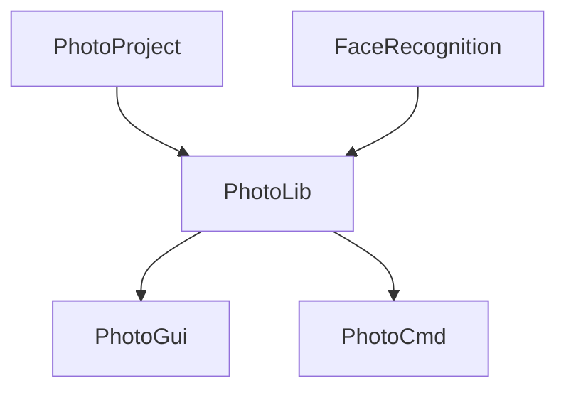
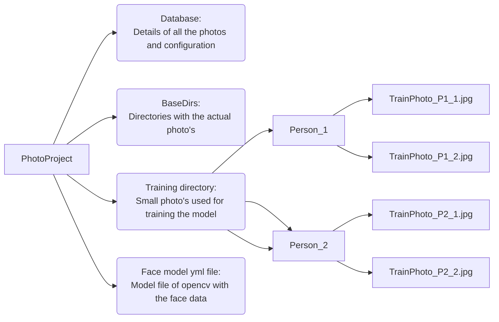
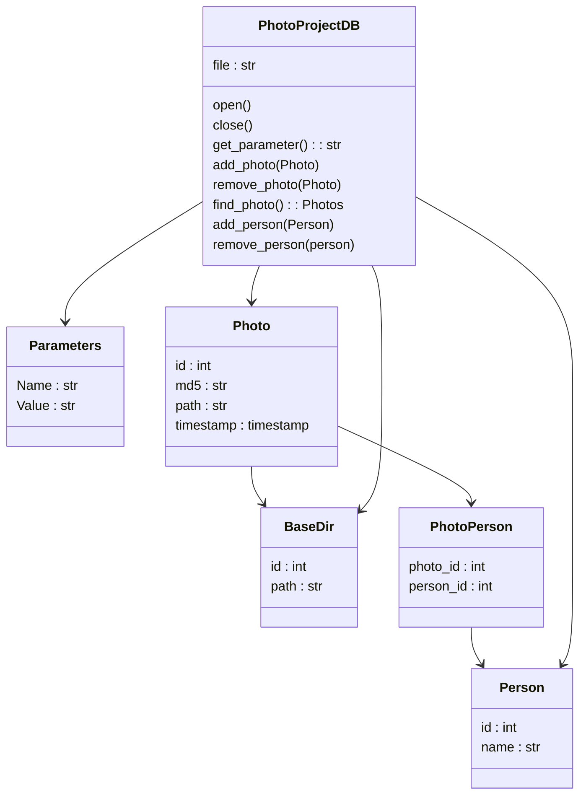
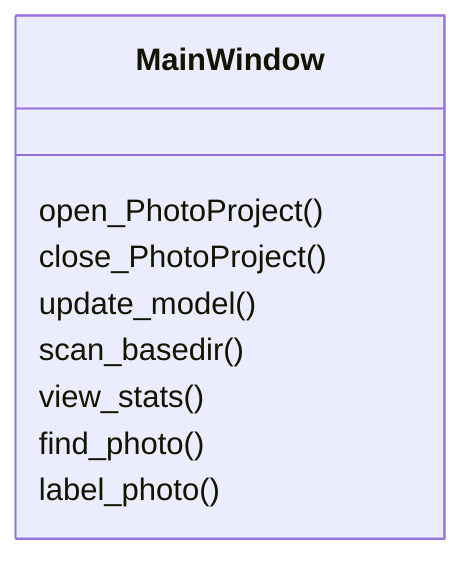

# Design of fotos

## Overview

```mermaid
  graph TD;
    PhotoProject --> PhotoLib
    FaceRecognition --> PhotoLib
    PhotoLib -->  PhotoGui
    PhotoLib -->  PhotoCmd

```

## PhotoProject

Goal is to have a container with all the settings and details that are relevant for one instance.

### Overview

```mermaid
  graph LR;
    PhotoProject --> Database(Database:\nDetails of all the photos and configuration)
    PhotoProject --> BaseDirs(BaseDirs:\nDirectories with the actual photo's)
    PhotoProject --> TrainDir(Training directory:\nSmall photo's used for training the model)
    TrainDir --> Person_1
    Person_1 --> TrainPhoto_P1_1.jpg
    Person_1 --> TrainPhoto_P1_2.jpg
    TrainDir --> Person_2
    Person_2 --> TrainPhoto_P2_1.jpg
    Person_2 --> TrainPhoto_P2_2.jpg

    TrainDir --> Person_2

    PhotoProject --> FaceModel(Face model yml file:\nModel file of opencv with the face data)
```

### Database

```mermaid
  classDiagram

    class Parameters {
        Name    : str
        Value   : str
    }

    class Photo {
        id          : int
        md5         : str
        path        : str
        timestamp   : timestamp
    }

    class BaseDir {
        id      : int
        path    : str
    }

    class Person {
        id      : int
        name    : str
    }

    class PhotoPerson {
        photo_id    : int
        person_id   : int
    }

    class PhotoProjectDB {
        file                    : str
        open()
        close()
        get_parameter()         : str 
        add_photo(Photo)
        remove_photo(Photo)
        find_photo()            : Photos
        add_person(Person)
        remove_person(person)
    }

    Photo --> BaseDir
    Photo --> PhotoPerson
    PhotoPerson --> Person

    PhotoProjectDB --> Parameters
    PhotoProjectDB --> Photo
    PhotoProjectDB --> BaseDir
    PhotoProjectDB --> Person


```

## Photo GUI

```mermaid
  classDiagram

    class MainWindow {
        open_PhotoProject()
        close_PhotoProject()
        update_model()
        scan_basedir()
        view_stats()
        find_photo()
        label_photo()
    }
```

